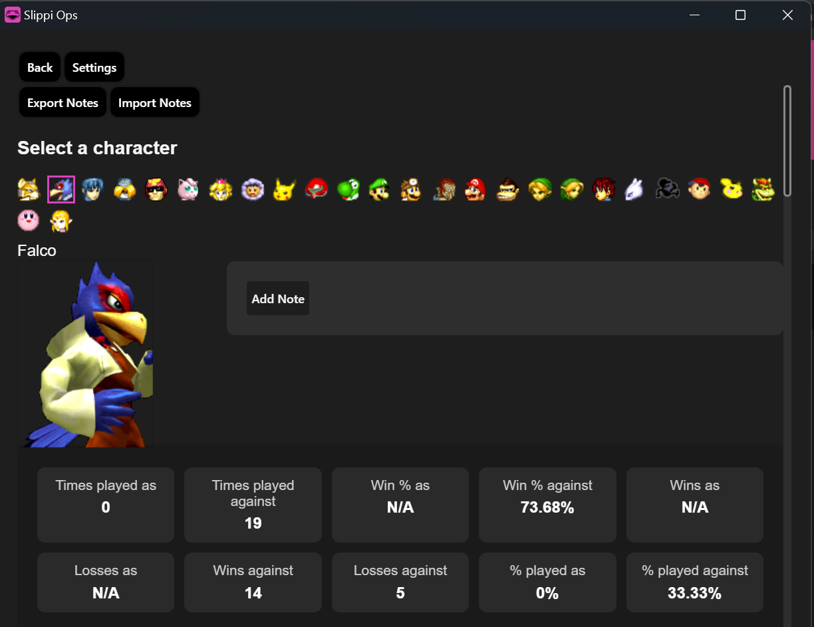
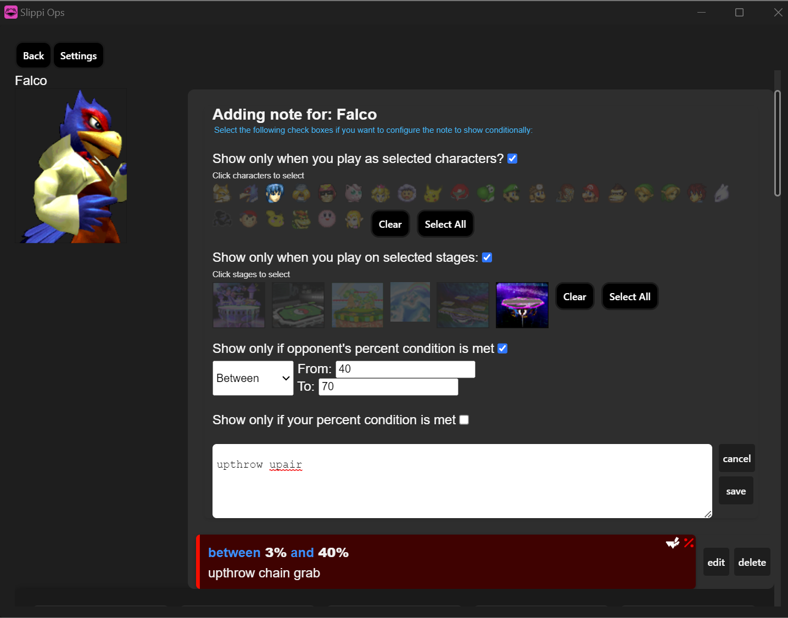
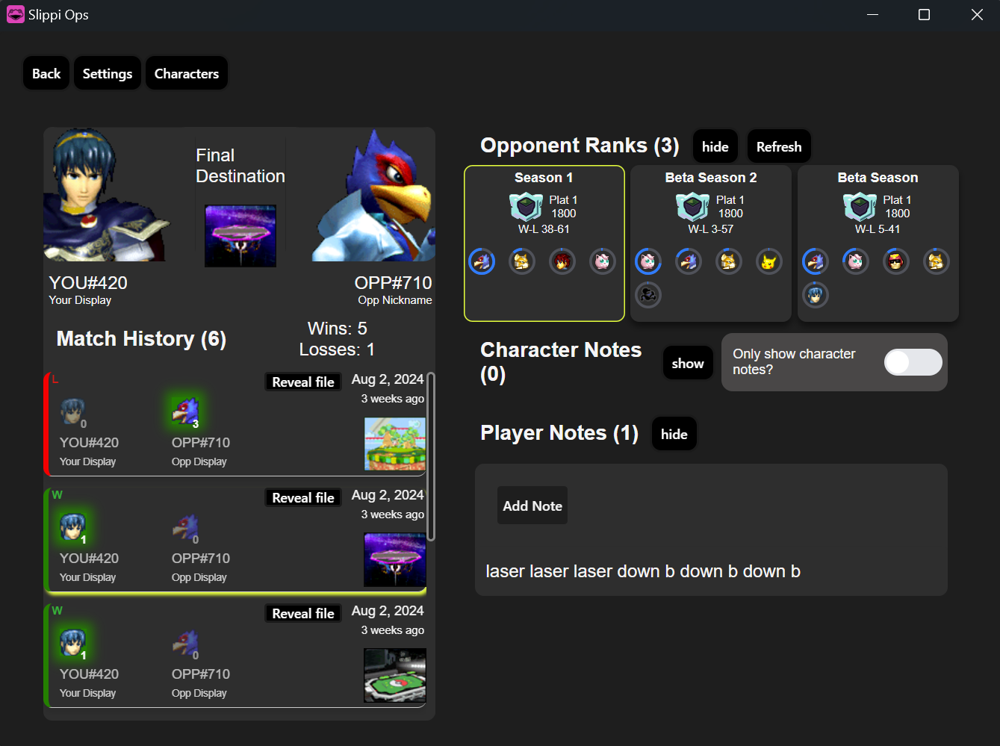
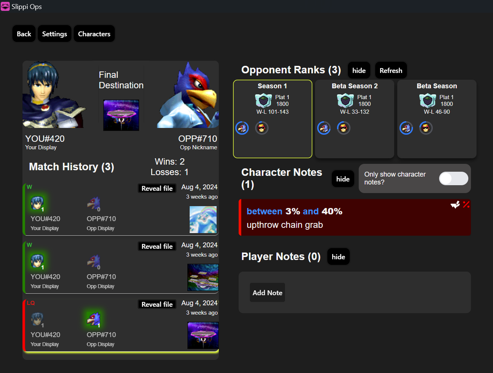
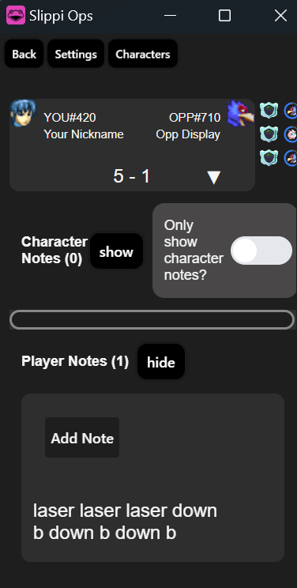
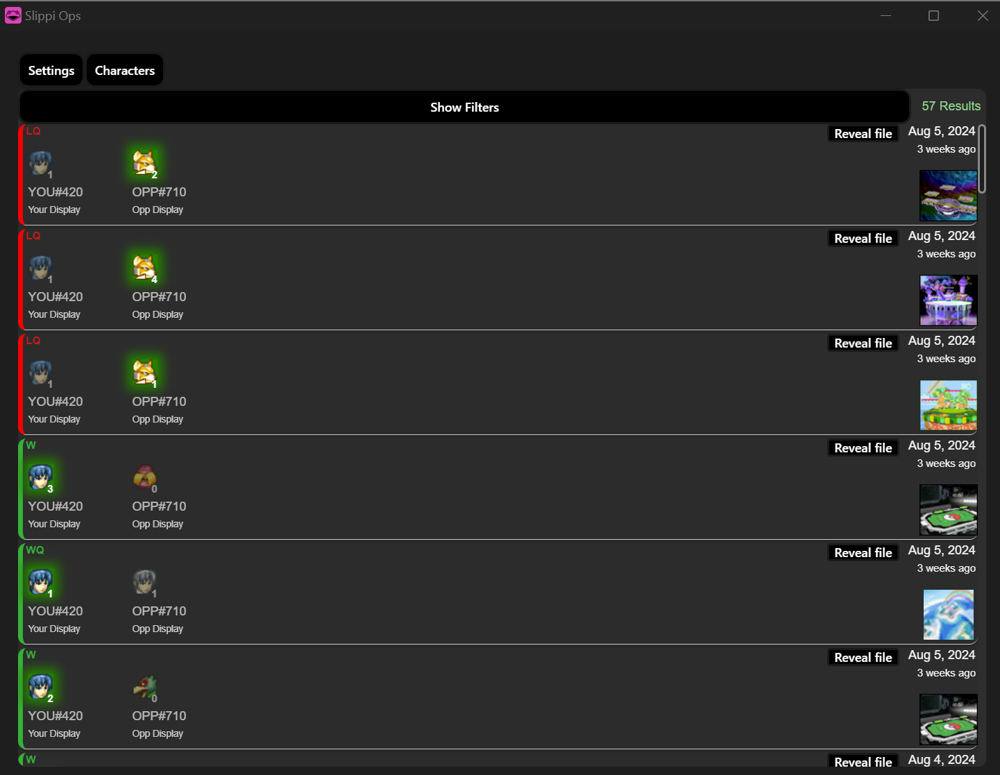
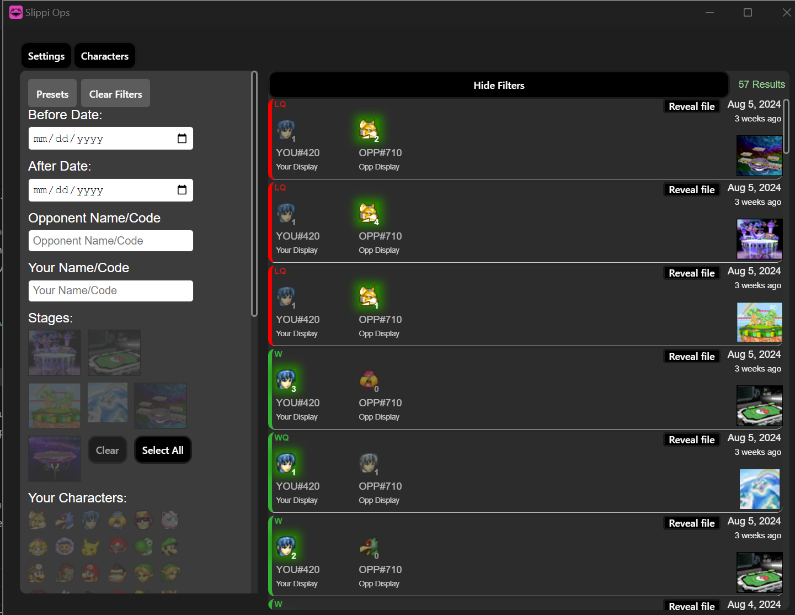

# Screen shots

(build instructions in next section)

## Character Notes

### Overview
Lists character stats from all your slippi files


### Edit/Add Notes
Customize notes that display when playing against the character.



## Match Display
- opponent match up history
- opponent's current and previous ranks with character usage. 
- character notes of the opponent's character
- player notes for opponent



### with character notes


### Small Display
Shows if you shrink the window size down to fit next to slippi.





## Previous Match List
Displays all your previous matches



### Filters
  - Date Range
  - Opponent name and codes
  - Your name and codes
  - Stages 
  - Opponent characters
  - Your characters
  - Opponent stocks remaining
  - Your stocks remaning
  - Include/Exclude games opponent quit
  - Include/Excluse games you quit
  - Ranked/Direct/Unranked 
  - Opponents rank at the time of match

---------
# Development / Building

Only requirement for building is node.js (install here https://nodejs.org/en), 
any version should probably work but I used 20.16.0. Also I have only tested on a windows machine, but it *should* work on mac/linux. No releases yet as it's probably still buggy and I just want to finally put the code out there incase I stop working on it.


## clone project (or download zip from github)
```sh
git clone https://github.com/visgotti/slippi-ops.git
```


## install dependencies
```sh
cd slippi-ops
npm i
```


## start project

```sh
npx nx serve desktop
```
or 
```sh
npm run dev
```

if you want to build it and then just use the .exe you can do 
```sh
npx nx build desktop
```

it will build it to `/apps/desktop/dist/win-unpacked/Slippi Ops.exe`

## i've only tested on windows, if you want to *try* mac/linux:
```sh
cd apps/desktop
npm run build:mac 
npm run build:linux
``` 
-----
----
----
----


### Notable Features
- Opponent record tracking
- Display opponent ranks/characters when matched up
- Robust previous match search/filtering
- Display character notes conditionally during game
- View character matchup statistics
  - win/loss rate per character matchup
  - win/loss rate per character matchup per legal stage
  - some other stuff

### Coming Soon™
  - downloadable release with auto updating
  - option to chat with opponent if both players in the match have the application open and have enabled the feature
  - bug fixes
  - change log

### Maybe in the future
  - friends list with messaging
  - backend to persist/share your character notes and potentially help process slippi files in parallel to speed up initial application startup.
  - visualize previous match searches with graphs similar to the characters screen
  - display actual slippi game stats somewhere (L cancel rate, etc)
  - more visual queues/style options for character notes
  - index slippi game stats and add search more robust filtering (search by combo damage, etc)
  - API to hook into some of the MatchTracker functionality from third party applications
  - Custom statistic visualization plugins